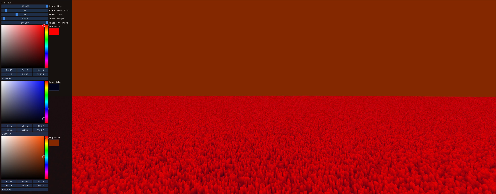
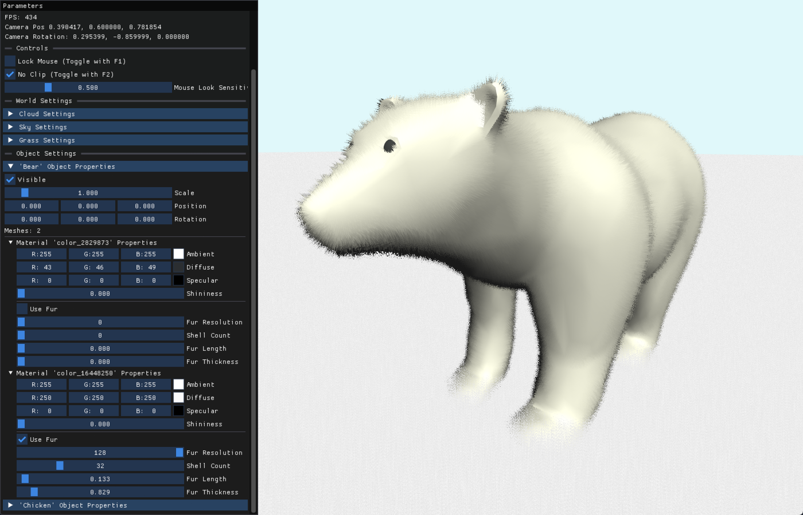
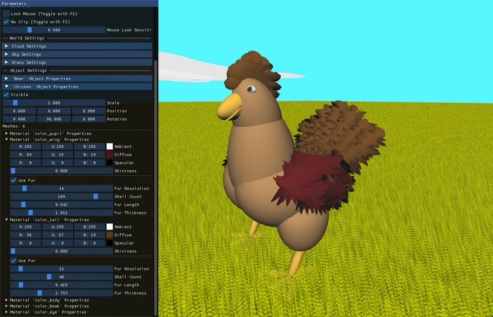
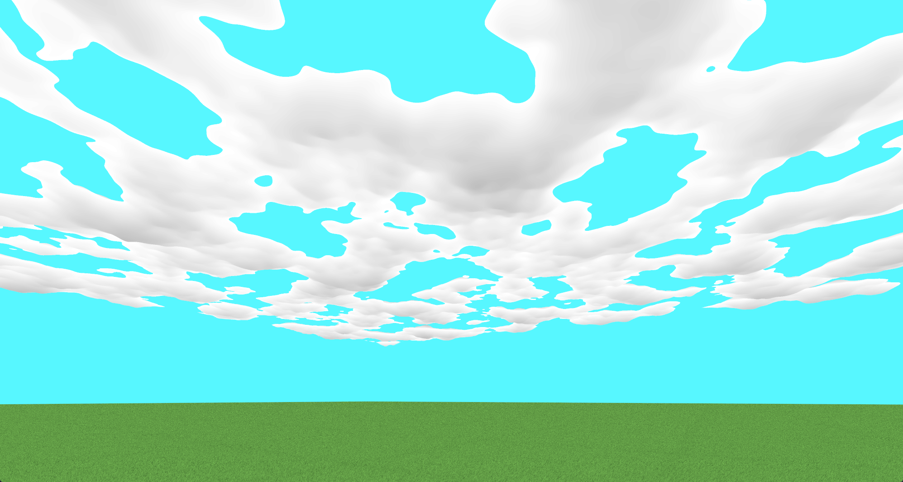
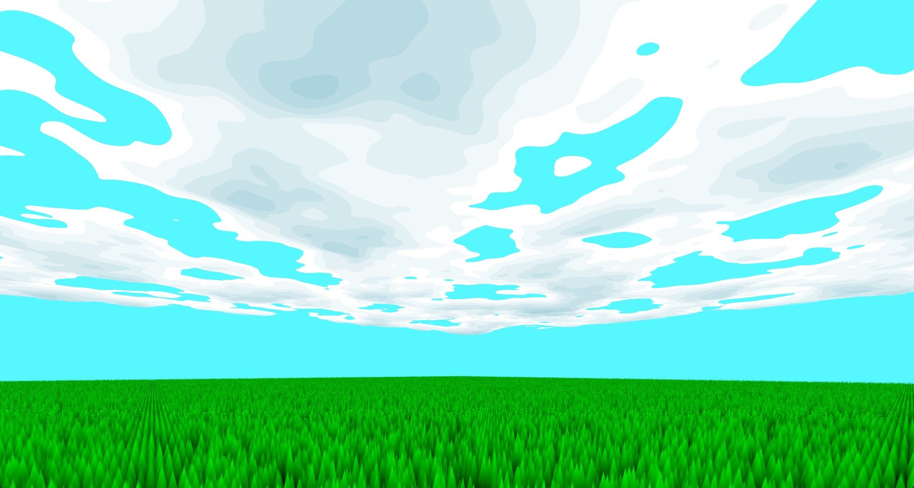

# Exploration of Shell Textured Worlds

This demo offers multiple scenes which show shell texturing applied to create grass, bumpy surfaces, fur, feathers, and clouds.

All parameters and materials are configurable at runtime using the properties panel created with ImGui.

**This project was originally for a course term project and has been adapted for publishing to GitHub.** Code
quality may be a bit of a mess as code quality was not evaluated in the project grade, but shouldn't be too bad!

## Report & Presentation

Find the report here: [PDF](./Report.pdf)

And watch the presentation here: <https://youtu.be/uOPR-rAUnL4> (sorry for the audio issues!)

## How to Run

Open `implementation/opengl.sln` in Visual Studio (2022) and hit Run. 

A Windows `.exe` build is also provided in the project releases.

## Controls

F1 toggles mouse lock and camera rotation
F2 toggles noclip

WASD to move around
F to go down (when noclip is enabled)
SPACE to go up (when noclip is enabled)

# Screenshots











# Important files

- `implementation/src/assignment1.cpp': Most of the rendering loop logic including drawing properties panel to the screen
- `implementation/src/ObjUtils.h`: My custom .obj and .mtl loaders and all relevant structs
- `implementation/src/blinnphong.h`: Code to bootstrap a given loaded obj model with the blinnphong+fur combo shader
- `implementation/src/grass.[vert/frag]`: Grass vertex and fragment shaders
- `implementation/src/shaders/*`: The rest of the shaders

## .obj and .mtl support

### Fur properties

Fur properties are loaded from the .mtl file and can be added to any existing material by adding a line with the following format:

```
# fur <shellCount:int> <shellMaxHeight:float> <thickness:float> <resolution:int>
# example:

fur 48 0.419 2.753 11
```

This allows selectively applying fur with different parameters to different object materials.

### Custom .obj files

If you want to load your own .obj files: the .obj file must have *vertex normals* to apply fur correctly. I used tinkercad to source my models but the .obj export did not include vertex normals. To fix this, I imported the .obj into Blender, enabled smooth shading for the object, then re-exported the wavefront data. This new export contains vertex normal definitions.

In `Init()` call `LoadObj(<obj path>, <mtl path>)` then call `ApplyBlinnPhong` to the returned struct.
Then in `Display()` call `DrawBlinnPhong(<obj struct>)`

# Resources

The project is heavily inspired by the YouTube video "How Are Games Rendering Fur?" by Acerola: https://www.youtube.com/watch?v=9dr-tRQzij4

However, no code was referenced from the provided repository. I developed my implementation from scratch using the course sample project as a boilerplate. 

All code is my own *except* library code (incl. ImGui) and noise generation functions in grass.frag and cloud.frag (these functions were written by Inigo Quilez with links cited in the references section of the report PDF).