\pagebreak

# Overview

The focus of this project is to explore different applications of shell texturing. The initial focus was to
develop an implementation of grass, hair and fur using shell texturing that is configurable and adaptable to different
environments and use-cases, while remaining performant and visually pleasing. With this achieved, I then move
on to exploring applying shell texturing to create stylized feathers, wind physics, visually abnormal surfaces, 
and clouds which can give the illusion of either a full volumetric implementation, or a stylized cel-shaded look.

Before discussing the implementation of shell texturing, it's worth exploring why shell texturing is a useful
approach to implementing hair and fur, and more to the point, why it simply isn't feasible to simulate fur with
physical accuracy in real-time graphics applications like video games.

## Why Rendering Physically Accurate Hair in Real-Time is Infeasible 

When thinking about the topic of rendering fur, your first idea may be to use modern raytracing hardware to
accurately simulate the physics and lighting model of strands of hair. However, when delving into the details,
it quickly becomes clear that rendering hair is one of the most complicated types of visuals to implement. Here's
an overview of why using raytracing for convicing fur simply doesnt work. Most of this section is
paraphrased from a YouTube video titled "How Are Games Rendering Fur?" [@gunnell-2023] plus some of my
own observations. Acerola is a former graphics programmer at Sony's "Bend" PlayStation development studio, and
gives a comprehensive introduction to the subject.

### Geometric Complexity

A typical person with healthy hair will have over 100,000 individual strands of hair [@seladi-schulman-2019].
And assuming we aren't discussing a porcupine with perfectly straight needle-like hair, each strand of hair must
be composed of multiple segments to allow the hair to have waves and curvature. The situation is even worse for
animals, where a cat can have around 25,000 strands of fur *per square centimetre* [@aydin-2021]. That's over
160,000 strands per square inch, meaning we would need to render 1-2 heads of human hair worth per square inch
of cat fur. Now, multiply all of this by the number of humans or pets you might have in a given scene of a video
game, and we are putting ourselves well over millions of individual fur segments that we would need to include
in our simulations.

### Lighting Complexity

Hair is not a closed solid mesh. It's tens of thousands of meshes all adjacent to each other with gaps in between.
This means for perfectly accurate raytraced lighting, we would need to simulate subsurface scattering of light
between tens of thousands of strands of hair with potentially tens of thousands of ray bounce simulations
to accurately model the lighting of inner surfaces.

On top of this, not all hair is the same. Lighting properties of real hair differs based on numerous properties,
including hair cleanliness, color, thickness, moisture, and strand shape such as straight, wavy or curly. The
age of hair is also highly variable and contributes to lighting, with the ends of a strand of hair being older
than hair near the base of the strand. This all means that simulating physically accurate lighting of hair
requires dozens of input properties that all affect the resulting lighting model.

### Physical Complexity

Most people don't soak their hair in intense amounts of styling gel to make their hair a solid block. In the
real world, hair is expected to flow with motion, air resistance, wind, and any interacting objects. Hair also
has some form of "state". If you have hair combed to the right, then run your hand through it pushing the hair
to the left, it is expected that the hair will not perfectly return to it's original state. Instead, the hair
should be somewhere in between, the stiffness pushing it back towards its original state but being overcome by
force of gravity, air resistance, or other objects in the hair like hair clips.

### Display Limitations

Even if we could overcome all of the obstacles of the complexity of the simulation, we face the final boss
of limitations: display hardware. A strand of hair typically has a width of less than 0.12mm at most [@dowd-2021],
meaning at any reasonable distance from the camera, each strand of hair is far thinner than the width of a pixel
on any consumer display. This means that on top of the hundreds of thousands of ray simulations necessitated
by the previous complexities per pixel, we now also need to run the simulation *multiple times per pixel* with
varying offsets through the sample and then combine the results together to accurately render the hair.

### We Need an Approximation

It's clear from all of the above that hair is an incredibly complex beast to tackle. And unfortunately for us,
hair is one of those things that humans are *really* good at detecting issues with, meaning any corners we cut
can leave the hair render falling in the "uncanny valley". It's obvious that rendering physically accurate
hair is just not in the cards, so how can we approximate hair with a level of detail that is convincing enough
while maintaining high performance, decent emulation of the results of the above complexities, while also ensuring
our hair doesn't result in it's wearers falling in the uncanny valley leaving viewers uneasy?

## Enter Shell Textures

Shell texturing refers to the process of extruding flat cross-sections out from a surface and layering enough
of these cross-sections to create the illusion of many solid meshes using only 2D plane or face surface textures.
By manipulating the textures of these extruded surfaces, we can approximate the complex visual properties of hair 
using comparatively very small amounts of simple geometry [@gim-2020].

![Visualization of the process of shell texturing to create fur [@gim-2020]](./images/01-shell-texturing-intro.jpg)

# First Steps: Grass with Shell Texturing

For this report, I will start with a step-by-step approach to implementing grass using shell texturing to 
highlight the core fundamentals of the process, before moving on to adding more complex features to improve the 
simulation and it's possible applications. I initially take the same approach to shell texturing as described by
Acerola [@gunnell-2023] before deviating from his implementation to add additional features.

It's worth mentioning why starting with grass is a good idea before moving on to hair and fur. Grass is 
essentially a lower-fidelity proxy for hair with many similar properties, consisting of many grass blades instead
of hair strands, but with those grass blades being much thicker and less numerous than strands of hair. We
can also get away with rendering grass on a flat surface, while when we render hair and fur later, we will
want it to wrap around a complex mesh like a head or body of an animal.

### Determing Grass Positions with Noise

Grass in the real world isn't uniformly distributed across a surface with uniform sizing. We expect there to
be variance between each blade of grass in terms of position, height, and thickness. To simulate the randomness
of these values, we will use a hash function to generate a noise texture to use as our source of randomness. So
as to not reinvent the wheel, and because I don't really understand how to make good hash functions, I'll be
using a hash function implementation published on Shadertoy by Inigo Quilez [@quilez-2017]. Using
the barycentric coordinates of a surface of a plane as input to this hash function and then applying the
output magnitude as a gray-scale value for the specified fragment, we can produce a noise texture on a plane.

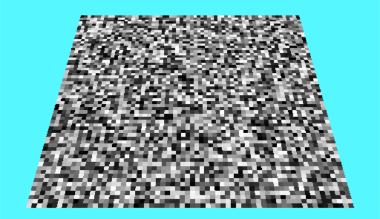{ width=50% }

With this implementation, we can increase the resolution of our noise texture by simply multiplying our barycentric
UV coordinates by however many pixels we want. In Figure 2 above, I use a value of 64.

Now going back to the idea of using this noise texture to decide where we want to place our grass, lets say that
anywhere a pixel intensity is greater than some value, say `0.01f`, we want grass there, and otherwise we want 
no grass. Let's also start using green to represent grass rather than black and white.

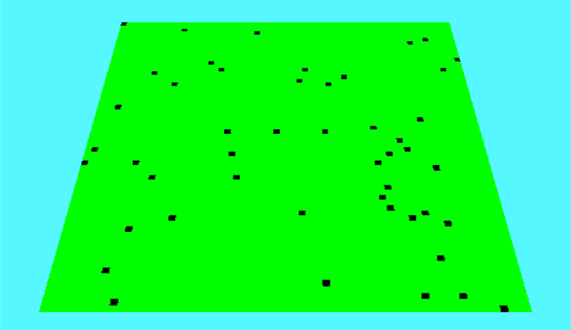{ width=50% }

This is a good start. Now let's apply the concept of "shell textures" by extruding the plane geometry out 
vertically and drawing it several times, say 16, each at different heights. Let's also adjust our grass 
existence check by comparing to the height of the current plane rather than some fixed number. Finally, instead
of returning a black pixel where there is no grass, let's discard the pixel using the `discard` keyword in the
fragment shader.

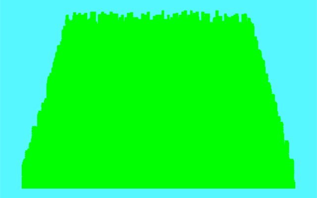{ width=50% }

Close! Everything looks like a big green blob since we have no shading. For now I'll fake some shading by
just adjusting the green intensity based on the height, and we'll return to implementing a better lighting
model later.

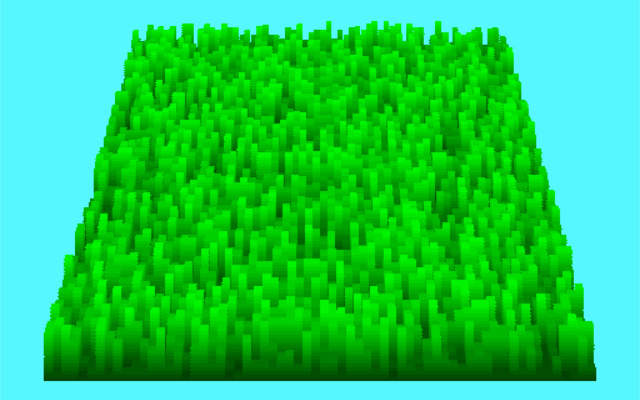{ width=50% }

Kinda resembles grass! This could easily pass in a video game as being some sort of stylistic choice, especially
in a voxel-based game. 

But real grass tapers off towards the top. We can do this by calculating the distance
of a given fragment from the center of its grass blade. Since we are multiplying our UV values by the number
of total grass blades, each grass blade is 1x1 unit in the UV coordinate space. We can get the fractional
part of our multiplied UV coordinate space to get the position within the current grass blade, do a quick translation
and scale operation to move the origin of this space to the center of the grass blade, then calculate the distance
between the UV coordinate and the origin of the grass blade. If the fragment is further from the center than we want,
we simply discard the pixel. If we make our maximum distance inversely proportional to the height of the shell,
we can have the width of the grass blade decrease with shells that are further upward.

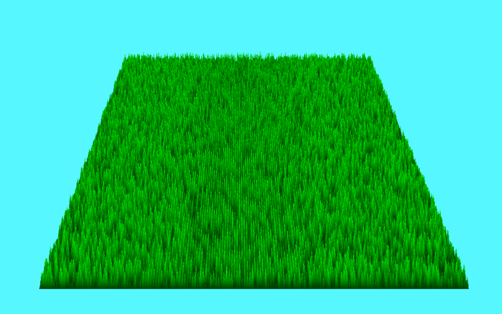

This looks pretty convincing! This shows the basic idea of shell texturing; by extruding our surface mesh
upwards and drawing it several times at different heights, we can taper the width of each grass blade at
each level. When it's all said and done, each plane will blend together to appear like a solid mesh of many
blades of grass, when in reality we are only drawing 128 triangles (2 per plane), far less than this many grass
blades with this geometry would take if we were to draw each grass blade individually. And, because the number
of triangles is independent to the number of grass blades, we can have as many grass blades we want within this
patch with no impact to performance (well, sort of, more on that later).

# Shell Texturing Parameters

We now have a basic shell texturing implementation for grass. To keep going, we are going to want to make the 
parameters for our simulation configurable. I added ImGui to my project, a immediate GUI component renderer
with a window manager and tons of built-in UI components. Using ImGui, it's incredibly easy to build a properties
UI pane like you might see in a game engine like Unity, and it takes less than 20 lines of code to get it running
in any OpenGL project. It even still supports the older freeglut framework that I am using for my project.

Using ImGui, I built a properties pane that exposes the following parameters for our grass simulation:
- Plane size (x/z)
- Plane resolution (blades of grass per square unit)
- Shell count
- Grass height (maximum height)
- Grass thickness (a multiplier for our distance check)
- Grass and sky colors (ImGui has a really great color picker built-in!)

I also added movement and camera controls similar to Minecraft's creative mode so we can move around more freely.
With all of this, we can start to get some really neat visuals:

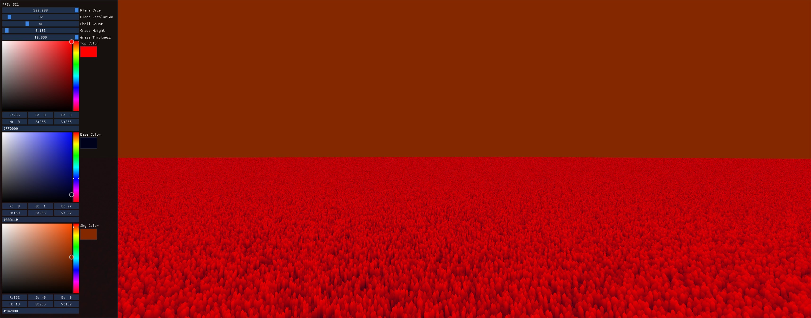

# Turning Grass Into Fur

We already have the basics necessary to render some fur, but there's one thing we are missing. We can't apply
our fur to a model! This is when we begin to deviate from Acerola's video, as they used Unity which has plenty
of helper functionality to get geometry details from models and use them within a shader. In pure OpenGL, we
need to do this ourselves.

## Loading Models

I began by writing a basic `.obj` and `.mtl` loader. Using this, I could easily import models from Tinkercad,
a beginner-friendly modelling tool with lots of pre-made models available from the community. I noticed however
that Tinkercad does not export vertex normals with the `.obj` file, and also does not enable smooth shading
for some models. To fix this, I imported the exported `.obj` and `.mtl` files into Blender, configured the
smooth shading, renamed the random material names to what they actually represent, and re-exported as `.obj` and
`.mtl`. When smooth shading is enabled, we get vertex normals for each vertex, and without smooth shading, we get
face normals for each vertex.

## Applying Fur to Models

The next step is to adjust our shader to apply our "grass" to the surface of a regular object. I started by writing
a basic blinn-phong shader to apply lighting to objects. I then combined this shader with our grass shader
from before, but instead of extruding our vertices upwards with height, I modified to shader to extrude our 
vertices along their normals. In other words, we now want to extrude additional copies of our model's faces 
outwards from our model instead of straight upwards.

Since any given model likely has several different materials applied to it, I wanted to enable the ability
to set fur properties for each material independently. To accomplish this, I added support for a custom line
in my `.mtl` loader:

```
# fur <shellCount:int> <shellMaxHeight:float> <thickness:float> <resolution:int>
# example:

fur 48 0.419 2.753 11
```

With this, I can independently apply fur with different parameters to different parts of a model. The first
object I tried this on was a polar bear, and with some fine-tuning of the parameters, we get a very convincing
fur approximation!

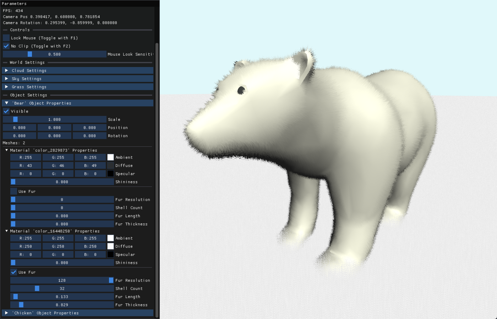

*(Side note: I found modifying the grass parameters could also give a decent visual for snow, though it isn't
very realistic)*

### Feathers

I wanted to try using this shader to apply feathers to a chicken next. The effect isn't the most realistic,
but it is certainly reminiscent of stylized feathers I've seen in video games before.

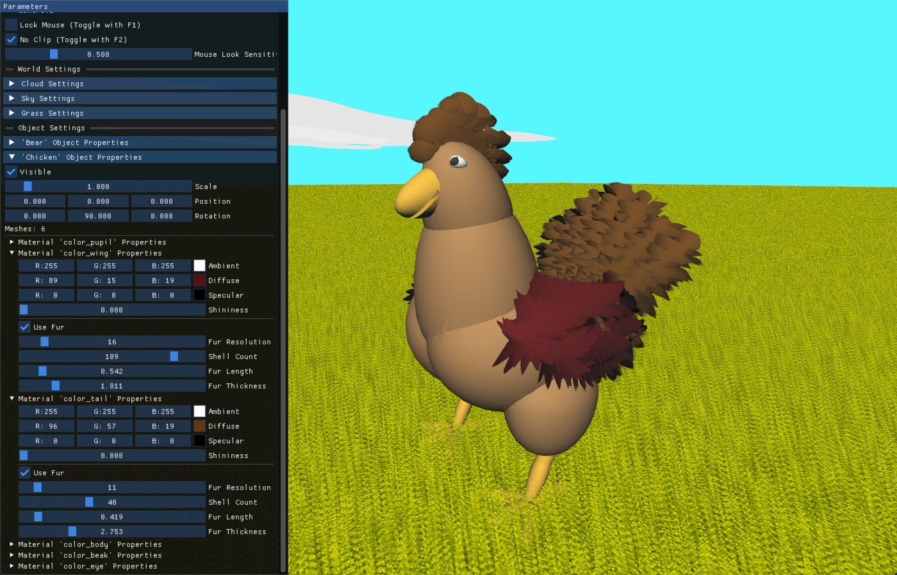

I think this particular example shows how much the directions of the vertex normals contribute to the overall
look. The wings look much more feather-like than the tail, because the normals of each are at very different
angles, our viewing angle of the tail isn't favorable. This begins to highlight one of the biggest weaknesses
of shell texturing, but we'll get to that later.

# Applying Physics

I wanted to see how feasible it is to dynamically morph the simulation based on physical interactions in the
world. I focused on implementing a wind effect to the grass from earlier. The easiest way to have our grass
sway in the wind is to simply translate the vertices of our planes, with a larger offset as height of each
plane increases. Using a simple mix of exponential curves to create a basic wind speed model, we get a decently
convincing wind effect for our grass. I can't show it in a paper document though, so you'll have to run the
demo to see it.

Since each plane is only defined by four vertices, we are limited to uniformly applying a translation to all
blades of grass. I didn't have time to investigate alternatives, but here are two ideas I had to allow more
precise physical interactions such as walking through grass or a hand on fur:

1. Use a tesselation shader to subdivide our plane (or face). This gives more vertices that we can control,
and would enable us to have a "sweeping" effect with our wind, where grass blades move more or less as the
wind ripples across the grass.
2. Distort our UV coordinates to shift the grass positions. This would add no extra vertices but give
effectively unlimited control over physical interactions of individual blades of grass. I am imagining applying
the bulging/inflation tool in Photoshop to push grass away from a certain position, like how a
person stepping in tall grass would push the grass further from their leg the further up the blades of grass.

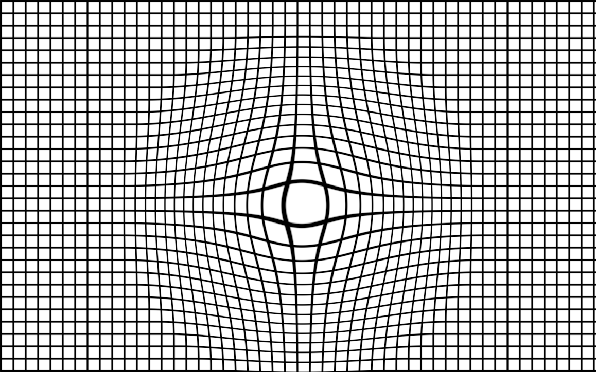{ width=50% }

# Alternative Noise Sources: Clouds

I wanted to see how different forms of noise could be used to create other types of visuals. Clouds are a common
graphical effect and are typically sourced from Perlin noise. I made a copy of the grass shader and swapped
the random noise hashing function for a pseudo-random perlin noise generator, also published on ShaderToy by
Inigo Quilez [@quilez-2013]. I then adjusted the grass shader to mirror the top and bottom, so that we also
get shapes underneath the plane. After fine-tuning some parameters, and using lots of shell layers, we can get 
a pretty convincing volumetric cloud visual with no volumetrics what-so-ever:

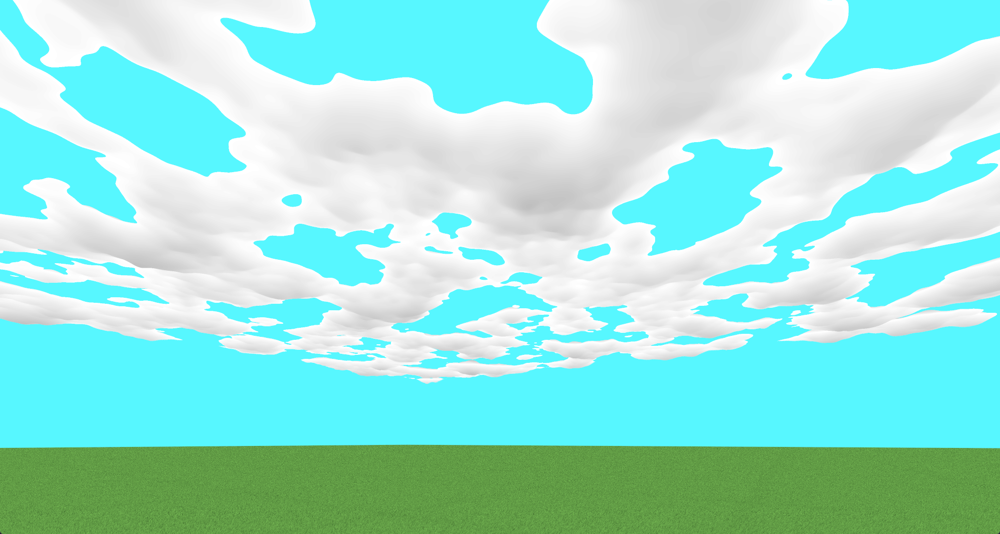

It's worth noting the above figure uses 128 shells, and performs *very poorly*. That doesn't mean it's all
for nothing though! Using less shells gives us an cartoon cel-shaded look that looks ripped straight out of
*The Legend of Zelda: The Wind Waker HD*:

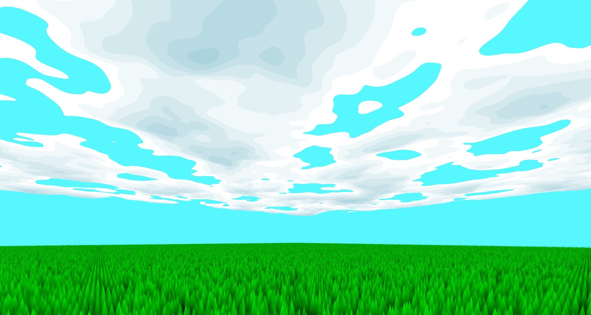

Since these clouds are generated from planes, we don't have the ability to curve the clouds at the horizon
to try and hide where the view plane clips. One solution would be to use distance fog, or alternatively, once
could use a tesselation shader like described earlier to add more vertices to the plane so we can curve the
vertices closer to the edge of the plane downwards.

# Limitations of Shell Texturing

With all of these implementations, we are able to see the problems with shell texturing. To make a convincing
illusion, we need to draw as many shells as we can. But, adding more shells drops our framerate significantly.
This is because discarding pixels is extremely inefficient. When OpenGL performs it's initial depth-buffer test,
it can accurately detect the plane closest to the camera. But, after running the fragment shader, there are tons
of holes in that plane. This means the depth buffer information that was previously generated was incomplete,
and the depth-buffer needs to be re-evaluated and fragments need to be re-drawn to fill in the gaps. This is
repeated for however many layers of shells you have, so adding more shells taking up more space on the screen
causes performance to drop dramatically. Thus, shell texturing is best suited for applications where you can
get away with very small amounts of shells, or for developing games for fixed hardware like consoles where you
can ride the limit of what the GPU can handle in terms of shell count.

The other fatal flaw that breaks the illusion provided by shell texturing is the nature of the technique itself.
Since we are simply drawing layers of flat 2D textures on top of each other, poor camera positions can see
straight through the layers.

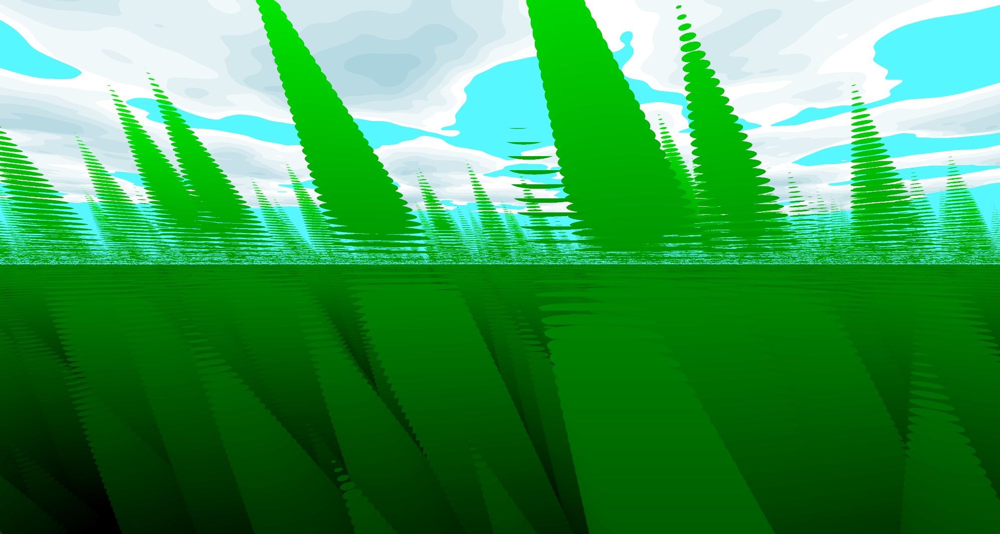{ width=70% }

Due to this, shell texturing is best suited for applications where you have contraints
on the camera position that prevent the camera from being able to see through the layers. This means you'll
probably have no issues with grass that's well below the viewer, or clouds that are well above the viewer. It also
means short fur or hair on a curved surface that is shorter than the camera height is typically fine as even with 
low shell counts, the distance between them is so small that they blend together nicely, and the differing normals
mean shells from one face can block seeing through the layers of another face. But, for larger creatures with 
unfortunate camera angles, the effect completely breaks down.

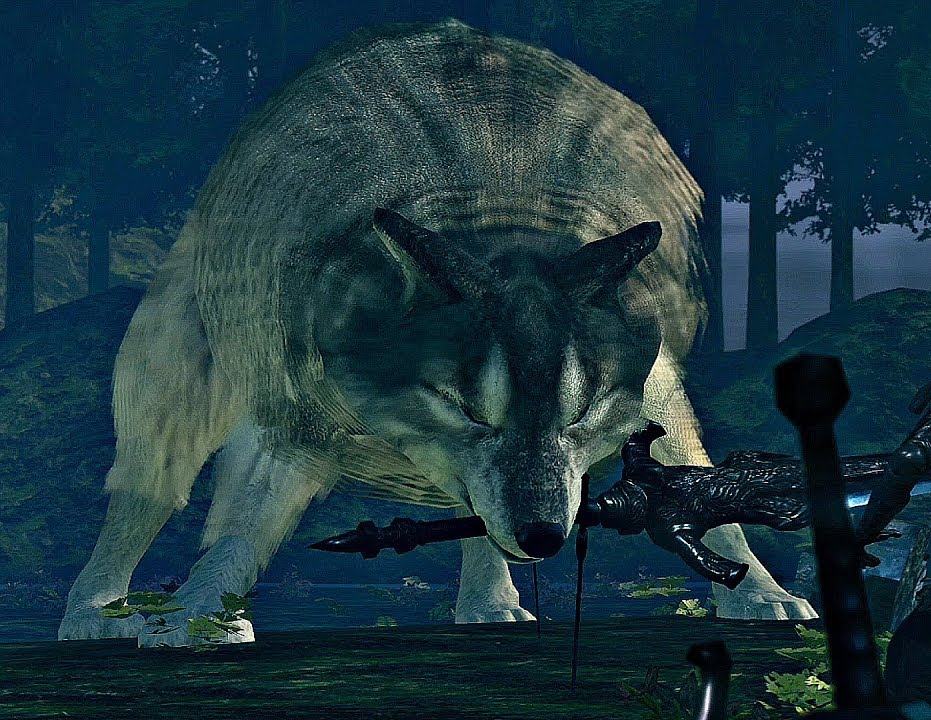{ width=70% }

# Conclusion

Shell texturing provides a very performant method of rendering grass, fur, and clouds by creating an illusion of
volume using stacks of flat 2D textures with various properties applied at the fragment shader to discard pixels.
The effect can certainly be stretched further to create other visuals like foliage, or combined with other types
of noise or even texture data to create more interesting landscapes. While shell texturing has it's limits, with
hardware capabilities improving with each year to enable more expansive use of shell texturing, the technique 
remains a useful tool in the game developers toolkit for creating high-performance and visually pleasing
environments in modern titles to this day.

# Acknowledgements

Thank you John Braico for teaching COMP 4490: Computer Graphics 2. The course content was incredibly interesting
and I would not have taken the time to research this technique without it!

Thank you to Acerola for providing the inspiration for this project and publishing so many excellent videos that
teach dozens of intersting core graphics concepts in a beginner-friendly and entertaining way. 

\pagebreak

# References